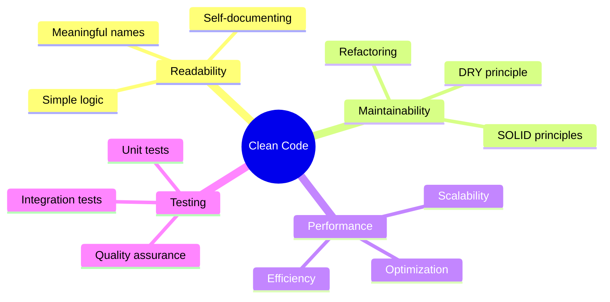

<div align="center">

<!-- Dynamic Header with Particle Animation -->


</div>

<!-- Animated Typing Effect -->
<div align="center">
  


</div>

<br>

<!-- Animated Divider -->


<br>

##  About Me


```typescript
const developer = {
    name: "Mostafa Awaga",
    pronouns: "He" | "Him",
    location: "Egypt 🇪🇬",
    role: "Full-Stack Developer",
    
    code: {
        languages: ["JavaScript", "Python", "C++", "C#"],
        frontend: ["HTML5", "CSS3", "JavaScript"],
        backend: [".NET", "C#", "Python"],
        databases: ["MySQL"],
        tools: ["Git", "Linux", "VS Code"]
    },
    
    mindset: {
        currentFocus: "Building scalable web applications 🌐",
        learning: ["Cloud Computing ☁️", "DevOps 🔧", "Microservices 🔄"],
        philosophy: "Clean code is not written by following a set of rules",
        motivation: "Solving problems one commit at a time 💪"
    },
    
    lifestyle: {
        workStyle: "Coffee-driven development ☕",
        debugging: "console.log() enthusiast 🐛",
        interests: ["Web Dev", "Tech", "Gaming", "Music"],
        motto: "Code, Learn, Repeat 🔁"
    },
    
    contact: {
        email: "mostafa.awaga@example.com",
        openTo: ["Collaboration", "Open Source", "Freelance"]
    }
};
```

<br>

### 🎯 What I'm Up To

<table>
<tr>
<td width="50%">

#### 🔭 Currently Working On
- Building **Full-Stack Web Applications**
- Exploring **Microservices Architecture**
- Contributing to **Open Source Projects**

</td>
<td width="50%">

#### 🌱 Currently Learning
- **Advanced .NET Core** & **ASP.NET**
- **Cloud Technologies** (Azure, AWS)
- **DevOps** & **CI/CD Pipelines**

</td>
</tr>
<tr>
<td width="50%">

#### 👯 Looking to Collaborate On
- Innovative **Web Applications**
- **Open Source** initiatives
- **Tech Community** projects

</td>
<td width="50%">

#### ⚡ Fun Facts
- Coffee + Code = Magic ☕💻
- I believe in **clean code** over clever code
- Gaming is my debugging therapy 🎮

</td>
</tr>
</table>

<br>


<br>

##  Technology Arsenal

<div align="center">

### 💻 Languages & Core Technologies

<p>
  
</p>

### 🎨 Frontend Universe

<p>
  
</p>

### ⚙️ Backend Ecosystem

<p>
  
</p>

### 🗄️ Database & Storage

<p>
  
</p>

### 🛠️ Tools & Workflow

<p>
  
</p>

</div>

<br>

<!-- Tech Stack Visualization -->
<div align="center">
  
### 📊 Technology Proficiency

```text
C#/.NET     ████████████████████░   95%
JavaScript  ██████████████████░░░   85%
Python      ████████████████░░░░░   75%
C++         ███████████████░░░░░░   70%
MySQL       ████████████████░░░░░   80%
Git         ██████████████████░░░   90%
Linux       ███████████████░░░░░░   75%
```

</div>

<br>


<br>

##  GitHub Performance

<div align="center">


</div>

<br>

<div align="center">
  
</div>

<br>


<br>

##  Let's Connect & Collaborate

<div align="center">

### 🌐 Find Me Across The Web

<br>

<a href="https://linkedin.com/in/mostafa-awaga" target="_blank">
  
</a>
<a href="https://fb.com/mostafa.hamed.983868" target="_blank">
  
</a>
<a href="https://instagram.com/mostafa_awaga_" target="_blank">
  
</a>

<br><br>

<!-- Social Icons with Animation Effect -->
<p>
  <a href="https://linkedin.com/in/mostafa-awaga" target="_blank">
    
  </a>
  &nbsp;&nbsp;&nbsp;&nbsp;
  <a href="https://fb.com/mostafa.hamed.983868" target="_blank">
    
  </a>
  &nbsp;&nbsp;&nbsp;&nbsp;
  <a href="https://instagram.com/mostafa_awaga_" target="_blank">
    
  </a>
</p>

<br>

### 💌 Open For Opportunities

<table>
<tr>
<td align="center" width="33%">

<br><b>Freelance Projects</b>
</td>
<td align="center" width="33%">

<br><b>Collaborations</b>
</td>
<td align="center" width="33%">

<br><b>Innovative Ideas</b>
</td>
</tr>
</table>

</div>

<br>


<br>

##  Code Philosophy

<div align="center">

### 💭 Developer Wisdom

> *"First, solve the problem. Then, write the code."* – John Johnson

> *"Code is like humor. When you have to explain it, it's bad."* – Cory House

> *"Make it work, make it right, make it fast."* – Kent Beck

<br>

### 🎯 My Development Principles



</div>

<br>


<br>

<div align="center">

##  Let's Build Something Extraordinary Together!

<br>


<br><br>

### 🚀 Ready to collaborate on your next big idea?

**Let's turn your vision into reality!**

<br>

<!-- Animated Footer -->


<br>

### ⭐ From [Mostafa Awaga](https://github.com/mostafa-awaga) | Crafted with 💜 and ☕

<br>

<!-- Animated Thank You -->


</div>
